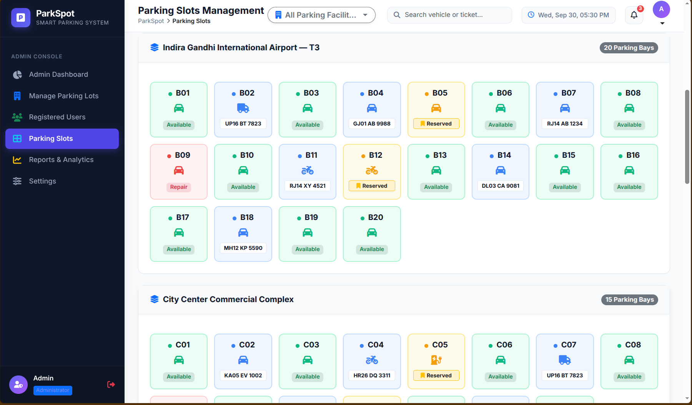
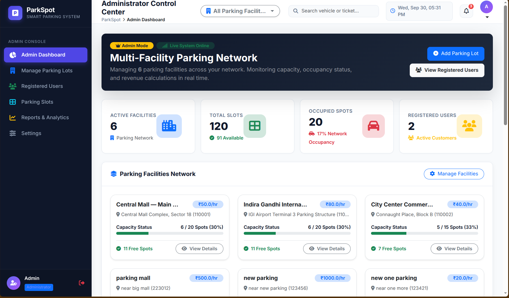
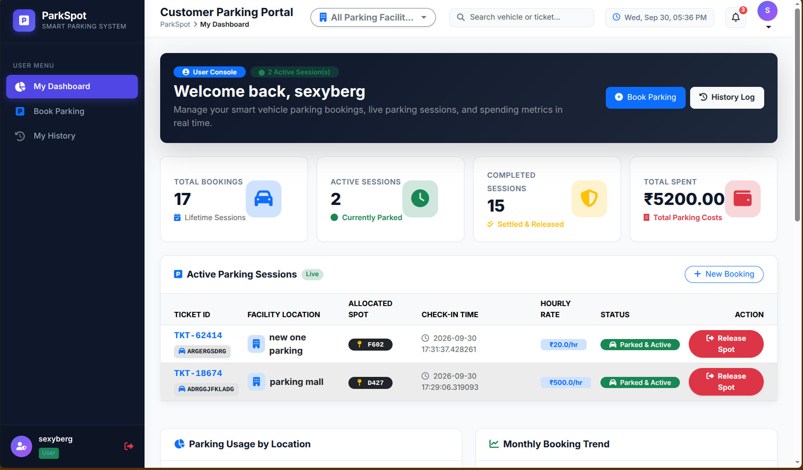

# ParkSpot - Intelligent Multi-Facility Vehicle Parking Management System

A production-grade, full-stack vehicle parking reservation and automated lot management platform built with Python, Flask, SQLite, and modern responsive front-end technologies.

---

## Executive Summary

ParkSpot delivers a centralized, real-time solution for managing multi-lot parking facilities, tracking spot occupancy, dynamic tariff calculations, and customer reservations. The system provides role-based workspaces for facility administrators and end customers with interactive visual bay mapping, ticket generation, automated fee settlement, and analytics telemetry.

---

## Interface Preview

### Administrator Control Center


### Real-Time Visual Parking Grid


### Customer Portal & Booking Management


---

## Core Capabilities

### 1. Facility & Slot Infrastructure
- **Multi-Facility Topology**: Global overview and isolated per-facility filtering across dashboards, grids, and financial reports.
- **Dynamic Slot Grid Layout**: Real-time visualization of individual parking bays with occupancy states (`Available`, `Occupied`, `Reserved`, `Maintenance`).
- **Vehicle Type Adaptation**: Tailored bay allocation and tariff matrices for Cars, Motorbikes, Bicycles, SUVs, EV Charging stations, and Heavy Commercial Vehicles.

### 2. User Reservation Engine
- **Pre-filled Spot Booking Modal**: Interactive bay selection with automated binding of Spot ID, Facility ID, and User ID.
- **Custom Vehicle Registration**: User-provided registration numbers with dynamic vehicle classification.
- **Live Ticket Lifecycle**: Check-in timestamp tracking, hourly billing calculations, and one-click spot release upon checkout.

### 3. Administrator Control Center
- **System Telemetry**: Real-time occupancy rate gauges, active facility counters, revenue summaries, and user distribution metrics.
- **Facility Management**: Provision new parking structures with automated bay generation, custom pricing, and capacity parameters.
- **Tariff Engine**: Configurable hourly, daily, and pass rates segmented by vehicle category.
- **Audit & Analytics**: Historical session tracking, location performance charts, and capacity trend logs.

### 4. Search & UI Engine
- **Global Live Search**: Client-side instant filtering across active parking sessions, booking records, user databases, and slot matrices.
- **Clean Notification Layer**: Automated flash feedback with timed auto-dismissal transitions.
- **Responsive Architecture**: Mobile-optimized layouts, collapsible side navigation, and interactive modal dialogs.

---

## Technical Stack

| Layer | Technology |
| :--- | :--- |
| **Backend Framework** | Python 3, Flask |
| **Form Handling & Validation** | Flask-WTF, WTForms |
| **Database Engine** | SQLite3 (Relational Schema with Foreign Key Constraints) |
| **Security & Auth** | Werkzeug Security (PBKDF2 Password Hashing, Session State Management) |
| **Frontend Framework** | Semantic HTML5, Vanilla CSS3, Bootstrap 5.3 |
| **Charts & Visualizations** | Chart.js |
| **Iconography & Fonts** | FontAwesome 6, Google Inter Font |

---

## Database Architecture

The relational schema is configured in `models.py` and consists of six core entities:

```
+----------------+        +-----------------+        +------------------+
|     users      |        |  parking_lots   |        |  parking_spots   |
+----------------+        +-----------------+        +------------------+
| id (PK)        |        | id (PK)         |        | id (PK)          |
| username       |        | prime_location  |---+    | lot_id (FK)      |---+
| email          |        | price           |   |    | spot_number      |   |
| password       |        | address         |   +--->| zone             |   |
| role           |        | pin_code        |        | spot_type        |   |
| created_at     |        | max_spots       |        | status           |   |
+----------------+        +-----------------+        +------------------+   |
        |                                                                   |
        |                 +------------------+                              |
        +---------------->|   reservations   |<-----------------------------+
                          +------------------+
                          | id (PK)          |
                          | ticket_id        |
                          | spot_id (FK)     |
                          | user_id (FK)     |
                          | vehicle_number   |
                          | vehicle_type     |
                          | parking_timestamp|
                          | leaving_timestamp|
                          | parking_cost     |
                          | payment_status   |
                          | status           |
                          +------------------+
```

---

## Getting Started

### Prerequisites
- Python 3.10+
- `pip` package manager
- Virtual environment support (`venv`)

### Installation

1. **Clone the repository**:
   ```bash
   git clone <repository-url>
   cd vehicle-parking-app-v1-main
   ```

2. **Create and activate a virtual environment**:
   ```bash
   python3 -m venv myv
   source myv/bin/activate
   ```

3. **Install dependencies**:
   ```bash
   pip install -r requirements.txt
   ```

4. **Initialize and run the application**:
   ```bash
   python app.py
   ```

5. **Access the application**:
   Open your browser and navigate to `http://127.0.0.1:5000`.

---

## Default Access Credentials

The database automatically seeds standard administrative and demo user credentials on initialization:

| Account Type | Username / Identifier | Email | Password | Role |
| :--- | :--- | :--- | :--- | :--- |
| **Administrator** | `admin` | `admin@parking.com` | `admin@123` | `admin` |
| **Customer User** | `user1` | `user@parking.com` | `user@123` | `user` |

---

## Application Route Map

### Public & Authentication Endpoints
- `GET /` - Root gateway redirecting based on session authorization.
- `GET, POST /login` - User authentication portal for Admin and Customer roles.
- `GET, POST /register` - Customer account creation interface.
- `GET /logout` - Session termination and state clearance.

### Customer Portal Endpoints
- `GET /user/dashboard` - Live dashboard displaying active sessions, metrics, and past reservations.
- `GET /book_parking` - Facility exploration and visual slot selection interface.
- `POST /confirm_booking` - Spot reservation submission and ticket generation.
- `POST /release_parking/<id>` - Parking session settlement and bay release.
- `GET /history` - Complete personal reservation history log.

### Administrator Console Endpoints
- `GET /admin/dashboard` - High-level network analytics, occupancy gauges, and system status.
- `GET, POST /admin/parking_lots` - Facility provisioning, capacity configuration, and rate updates.
- `GET /admin/parking_lot_details/<id>` - Granular facility spot inspection.
- `POST /admin/lots/edit/<id>` - Lot attribute modifications.
- `POST /admin/lots/delete/<id>` - Facility decommissioning (requires empty slots).
- `GET /parking_slots` - Global/filtered visual slot matrix with maintenance management.
- `POST /edit_parking_slot` - Individual bay type, zone, and status configuration.
- `GET /admin/users` - Registered customer registry and session logs.
- `GET /reports` - Revenue aggregation, facility performance comparisons, and export data.
- `GET, POST /settings` - Vehicle tariff matrix management.
- `GET /set_active_lot/<id>` - Global workspace facility filter switcher.

---

## Directory Structure

```
vehicle-parking-app/
├── app.py                 # Core application controller and route definitions
├── forms.py               # WTForms form classes and input validators
├── models.py              # SQLite database schema, connections, and seed engine
├── requirements.txt       # Project dependency specifications
├── parking_app.db         # SQLite database file (generated automatically)
├── static/
│   ├── css/
│   │   └── style.css      # Primary design system, components, and layout styling
│   └── js/
│       ├── app.js         # Interactive DOM logic, modal bindings, and live search
│       └── charts.js      # Chart.js analytics visualizations and render helpers
└── templates/
    ├── base.html          # Base master layout with navigation, top bar, and notifications
    ├── login.html         # User and Administrator sign-in view
    ├── register.html      # Customer registration view
    ├── history.html       # Session history view
    ├── parking_slots.html # Visual parking bay layout and maintenance view
    ├── reports.html       # Financial and operational analytics view
    ├── settings.html      # Tariff and rate configuration view
    ├── admin/
    │   ├── dashboard.html           # Administrator control center
    │   ├── parking_lots.html        # Multi-facility management
    │   ├── parking_lot_details.html # Granular facility inspector
    │   ├── users.html               # User registry table
    │   └── user_details.html        # Individual user detail inspector
    └── user/
        ├── dashboard.html     # Customer portal dashboard
        └── book_parking.html  # Interactive parking bay booking view
```

---

## Security & Operational Standards
- **Password Security**: Passwords hashed using PBKDF2 with SHA-256 via Werkzeug.
- **SQL Injection Prevention**: Parameterized queries enforced across all database transactions.
- **Session Security**: Server-side session validation on all protected endpoints.
- **Safety Constraints**: Database foreign key cascades and deletion locks on active occupied facilities.


